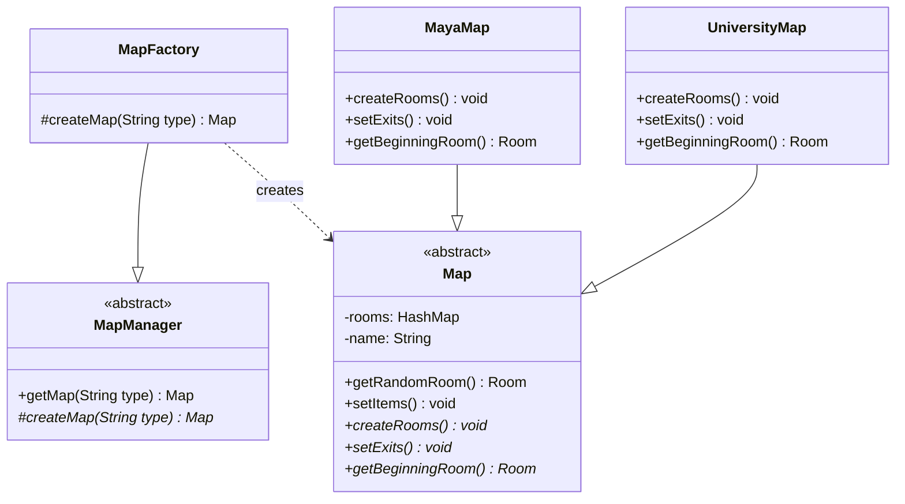

# Die Welt von Zuul – Factory-Method-Pattern

## Erstellung verschiedener Landschaften durch das Factory-Method-Pattern

Eine Factory, die üblicherweise statische Methoden anbietet, ist für sich noch **kein Design Pattern**. Sie ist zwar äußerst nützlich, gilt aber lediglich als **Idiom**.

Das Design-Pattern, das eine Factory benutzt, nennt sich **Factory-Method-Pattern**.

## Problem der vorherigen Lösung

Unsere Factory aus der vorigen Version weist unter dem Gesichtspunkt der **Wiederverwendbarkeit** einen Fehler auf:

!!! danger "Problem"
    Die öffentliche Methode `Map createMap(String type)` von `MapFactory` kann aufgerufen werden, **ohne dass die Landschaft weiterverarbeitet wird** – nämlich ohne dass die Landschaft mit Gegenständen versehen wird.

Unser Entwurf entkoppelt also die **Objekterstellung** zu stark von der **weiteren Objektverarbeitung**.

!!! warning "Maximale Entkopplung ist nicht immer sinnvoll"
    Soll jede Landschaft mit Gegenständen ausgeliefert werden, ist maximale Entkopplung nicht sinnvoll.

## Lösung: Factory-Method-Pattern

Das Factory-Method-Pattern:

1. **Trennt** die Objekterstellung von dessen weiterer Verarbeitung
2. **Koppelt** beide dennoch aneinander

### Umsetzung mit Vererbung

Die Lösung liegt im Einsatz von **Vererbung** und der Verwendung einer **abstrakten Methode**, die eine Subklasse implementieren muss. Diese abstrakte Methode ist die namensgebende **Factory Method**.

### Neue Struktur

1. Die Klasse `MapManager` bietet die Methode `Map createMap(String type)` an
    - Sie hat den Modifizierer `protected`, um zu verhindern, dass sie unkontrolliert von außen aufgerufen werden kann

2. Die **Factory Method** wird innerhalb der Methode `getMap(String type)` aufgerufen
    - Diese Methode nimmt auch die weitere Verarbeitung des instanziierten Map-Objekts vor

3. Die `MapFactory` **erbt** nun vom `MapManager`
    - Sie muss die Methode `Map createMap(String type)` ausimplementieren

4. Im **Client** (Klasse `Game`):
    - Es kann kein `MapManager`-Objekt mehr instanziiert werden
    - Stattdessen wird die `MapFactory` verwendet

## Aufgaben

### Aufgabe 1 – Refactoring zum Factory-Method-Pattern

- [ ] Führe ein Refactoring der Anwendung durch, indem du die Factory durch das **Factory-Method-Pattern** ersetzt
- [ ] Teste deine Anwendung

!!! tip "Vorteile des Factory-Method-Patterns"
    - Die Objekterstellung ist von der Weiterverarbeitung getrennt, aber beide sind kontrolliert miteinander verbunden
    - Neue Landschaftstypen können leicht hinzugefügt werden
    - Die Klasse `Game` ist von den konkreten Landschaftsklassen entkoppelt
