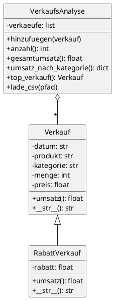

# Python – Abschlussprojekt: Verkaufsdaten-Auswertung

## Projektbeschreibung

Entwickle ein **Auswertungstool** für Verkaufsdaten. Das Projekt kombiniert die erlernten Python-Konzepte: Klassen, Listen, Dictionaries und Dateiverarbeitung.

!!! abstract "Szenario"
    Du arbeitest im Controlling und sollst ein Tool schreiben, das Verkaufsdaten aus einer CSV-Datei einliest und Auswertungen durchführt.

---

## Anforderungen

Dein Programm soll:

1. CSV-Datei mit Verkaufsdaten einlesen
2. Daten in Objekten speichern
3. Gesamtumsatz berechnen
4. Umsatz nach Kategorie gruppieren
5. Ergebnisse formatiert ausgeben

!!! note "Hilfreiche Infoblätter"
    - [:material-book-open-variant: OOP in Python](../infoblaetter/oop-python.md) – Klassen und Objekte
    - [:material-book-open-variant: Dictionaries](../infoblaetter/dictionaries.md) – Gruppierung von Daten
    - [:material-book-open-variant: Exceptions](../infoblaetter/exceptions.md) – Fehlerbehandlung beim Datei-Lesen

---

## Aufgaben

### Aufgabe 1 – Klasse Verkauf

Erstelle eine Klasse, die einen einzelnen Verkauf repräsentiert.

- [ ] **Erstelle die Klasse `Verkauf`:**

    **Attribute:**
    
    | Attribut | Typ | Beschreibung |
    |----------|-----|--------------|
    | `datum` | str | Verkaufsdatum |
    | `produkt` | str | Produktname |
    | `kategorie` | str | Produktkategorie |
    | `menge` | int | Verkaufte Menge |
    | `preis` | float | Einzelpreis |

    **Methoden:**
    
    | Methode | Rückgabe | Beschreibung |
    |---------|----------|--------------|
    | `umsatz(self)` | float | Berechnet Menge × Preis |
    | `__str__(self)` | str | Formatierte Ausgabe |

    **Test – so soll es funktionieren:**
    ```python
    v = Verkauf("2024-01-05", "Laptop", "Elektronik", 2, 999.00)
    print(v)           # 2024-01-05: Laptop - 1998.00€
    print(v.umsatz())  # 1998.0
    print(v.kategorie) # Elektronik
    ```

---

### Aufgabe 2 – Klasse RabattVerkauf (Vererbung)

Manchmal werden Produkte mit Rabatt verkauft. Erstelle eine **Unterklasse**, die von `Verkauf` erbt.

!!! info "OOP-Konzept: Vererbung"
    `RabattVerkauf` **erbt** alle Attribute und Methoden von `Verkauf`, fügt aber ein neues Attribut hinzu und überschreibt die `umsatz()`-Methode.

- [ ] **Erstelle die Klasse `RabattVerkauf`:**

    **Zusätzliches Attribut:**
    
    | Attribut | Typ | Beschreibung |
    |----------|-----|--------------|
    | `rabatt` | float | Rabatt in Prozent (z.B. 10 für 10%) |

    **Überschriebene Methoden:**
    
    | Methode | Rückgabe | Beschreibung |
    |---------|----------|--------------|
    | `umsatz(self)` | float | Menge × Preis × (1 - Rabatt/100) |
    | `__str__(self)` | str | Zeigt auch den Rabatt an |

    !!! tip "Hinweis: Vererbung in Python"
        ```python
        class RabattVerkauf(Verkauf):  # Erbt von Verkauf
            def __init__(self, datum, produkt, kategorie, menge, preis, rabatt):
                super().__init__(datum, produkt, kategorie, menge, preis)  # Elternklasse aufrufen
                self.rabatt = rabatt
            
            def umsatz(self):
                # Überschreibt die Methode der Elternklasse
                pass
        ```

    **Test – so soll es funktionieren:**
    ```python
    # Normaler Verkauf
    v1 = Verkauf("2024-01-05", "Laptop", "Elektronik", 1, 1000.00)
    print(v1.umsatz())  # 1000.0
    
    # Verkauf mit 20% Rabatt
    v2 = RabattVerkauf("2024-01-05", "Laptop", "Elektronik", 1, 1000.00, 20)
    print(v2.umsatz())  # 800.0
    print(v2)           # 2024-01-05: Laptop - 800.00€ (20% Rabatt)
    ```

---

### Aufgabe 3 – Polymorphismus testen

Beide Klassen können in derselben Liste verwendet werden!

!!! info "OOP-Konzept: Polymorphismus"
    Beide Verkaufstypen haben eine `umsatz()`-Methode. Python ruft automatisch die richtige Version auf – je nachdem, welcher Typ das Objekt ist.

- [ ] **Teste die Klassen zusammen:**

    ```python
    verkaeufe = [
        Verkauf("2024-01-05", "Laptop", "Elektronik", 2, 999.00),
        RabattVerkauf("2024-01-05", "Maus", "Zubehör", 10, 29.99, 15),
        Verkauf("2024-01-06", "Monitor", "Elektronik", 1, 349.00),
        RabattVerkauf("2024-01-06", "Tastatur", "Zubehör", 5, 79.99, 10)
    ]
    
    gesamt = 0
    for v in verkaeufe:
        print(f"{v} → {v.umsatz():.2f}€")
        gesamt += v.umsatz()  # Ruft die richtige Methode auf!
    
    print(f"\nGesamt: {gesamt:.2f}€")
    ```

---

### Aufgabe 4 – Klasse VerkaufsAnalyse

Erstelle eine Klasse, die **mehrere Verkäufe verwaltet** und die Auswertungen durchführt.

!!! info "OOP-Konzept: Aggregation"
    Die Klasse `VerkaufsAnalyse` **enthält** eine Liste von `Verkauf`-Objekten. Das nennt man **Aggregation** – eine Klasse nutzt andere Klassen als Bausteine.

- [ ] **Erstelle die Klasse `VerkaufsAnalyse`:**

    **Attribute:**
    
    | Attribut | Typ | Beschreibung |
    |----------|-----|--------------|
    | `verkaeufe` | list | Liste von Verkauf-Objekten |

    **Methoden:**
    
    | Methode | Rückgabe | Beschreibung |
    |---------|----------|--------------|
    | `__init__(self)` | - | Initialisiert leere Liste |
    | `hinzufuegen(self, verkauf)` | - | Fügt einen Verkauf zur Liste hinzu |
    | `anzahl(self)` | int | Gibt Anzahl der Verkäufe zurück |
    | `gesamtumsatz(self)` | float | Summe aller Umsätze |
    | `umsatz_nach_kategorie(self)` | dict | Dictionary `{Kategorie: Summe}` |
    | `top_verkauf(self)` | Verkauf | Verkauf mit höchstem Einzelumsatz |

    **Test – so soll es funktionieren:**
    ```python
    analyse = VerkaufsAnalyse()
    
    v1 = Verkauf("2024-01-05", "Laptop", "Elektronik", 2, 999.00)
    v2 = Verkauf("2024-01-05", "Maus", "Zubehör", 5, 29.99)
    
    analyse.hinzufuegen(v1)
    analyse.hinzufuegen(v2)
    
    print(analyse.anzahl())        # 2
    print(analyse.gesamtumsatz())  # 2147.95
    print(analyse.top_verkauf())   # 2024-01-05: Laptop - 1998.00€
    ```

    !!! tip "Hinweis: Gruppierung"
        Für `umsatz_nach_kategorie` nutze ein Dictionary:
        ```python
        kategorien = {}
        for v in self.verkaeufe:
            if v.kategorie not in kategorien:
                kategorien[v.kategorie] = 0
            # Umsatz addieren...
        return kategorien
        ```

---

### Aufgabe 5 – CSV in VerkaufsAnalyse laden

Erweitere die Klasse `VerkaufsAnalyse` um eine Methode zum Laden der CSV-Datei.

- [ ] **Lade zuerst `verkaufsdaten.csv` herunter:**

    [:material-download: verkaufsdaten.csv herunterladen](../assets/files/verkaufsdaten.csv){ .md-button }

    Die Datei enthält über 100 Verkaufsdatensätze mit den Spalten:
    
    | Spalte | Beschreibung |
    |--------|--------------|
    | `datum` | Verkaufsdatum (YYYY-MM-DD) |
    | `produkt` | Produktname |
    | `kategorie` | Elektronik, Zubehör, Bürobedarf, Software |
    | `menge` | Verkaufte Menge |
    | `preis` | Einzelpreis in Euro |

- [ ] **Füge die Methode `lade_csv(self, dateipfad)` hinzu:**

    | Parameter | Beschreibung |
    |-----------|--------------|
    | `dateipfad` | Pfad zur CSV-Datei |

    Die Methode soll:
    
    - Die Datei öffnen mit `encoding='utf-8'`
    - Für jede Zeile ein `Verkauf`-Objekt erstellen
    - Das Objekt mit `self.hinzufuegen()` zur Liste hinzufügen

    !!! tip "Hinweis: CSV einlesen"
        ```python
        import csv
        
        def lade_csv(self, dateipfad):
            with open(dateipfad, 'r', encoding='utf-8') as datei:
                reader = csv.DictReader(datei)
                for zeile in reader:
                    # Verkauf-Objekt erstellen und hinzufügen
                    pass
        ```

    **Test:**
    ```python
    analyse = VerkaufsAnalyse()
    analyse.lade_csv('verkaufsdaten.csv')
    print(f"Geladen: {analyse.anzahl()} Verkäufe")  # Geladen: 108 Verkäufe
    ```

---

### Aufgabe 6 – Hauptprogramm

Füge alles zusammen zu einem vollständigen Programm.

- [ ] **Erstelle `main.py` mit der Funktion `main()`:**

    Das Hauptprogramm soll:
    
    1. Ein `VerkaufsAnalyse`-Objekt erstellen
    2. Die CSV-Daten laden
    3. Alle Auswertungen über die Methoden des Objekts aufrufen

    **Erwartete Ausgabe (ungefähr):**
    ```
    === Verkaufsdaten-Auswertung ===

    Geladene Verkäufe: 108

    Gesamtumsatz: 87.432,50€

    Umsatz nach Kategorie:
      Elektronik: 52.891,00€
      Zubehör: 12.543,20€
      Bürobedarf: 8.765,30€
      Software: 13.233,00€

    Top-Verkauf: 2024-01-21: Laptop - 1499.00€
    ```

    !!! tip "Hinweis: Programmstruktur"
        ```python
        def main():
            analyse = VerkaufsAnalyse()
            analyse.lade_csv('verkaufsdaten.csv')
            
            print(f"Geladene Verkäufe: {analyse.anzahl()}")
            print(f"Gesamtumsatz: {analyse.gesamtumsatz():.2f}€")
            # ...
        
        if __name__ == "__main__":
            main()
        ```

---

### Aufgabe 7 – Erweiterungen (optional)

Wenn du fertig bist, erweitere das Programm um zusätzliche Methoden.

- [ ] **Durchschnittlicher Umsatz:**

    Füge eine Methode `durchschnitt(self)` zur Klasse `VerkaufsAnalyse` hinzu.

- [ ] **Verkäufe filtern:**

    Füge eine Methode `filtere_nach_kategorie(self, kategorie)` hinzu, die eine neue `VerkaufsAnalyse` nur mit Verkäufen dieser Kategorie zurückgibt.

    Test:
    ```python
    elektronik = analyse.filtere_nach_kategorie("Elektronik")
    print(f"Elektronik-Verkäufe: {elektronik.anzahl()}")
    print(f"Elektronik-Umsatz: {elektronik.gesamtumsatz():.2f}€")
    ```

---

## Projektstruktur

Am Ende solltest du folgende Dateien haben:

```
projekt/
├── verkauf.py          # Klassen Verkauf und RabattVerkauf
├── analyse.py          # Klasse VerkaufsAnalyse
├── main.py             # Hauptprogramm
└── verkaufsdaten.csv   # Datendatei
```

Oder alles in einer Datei, wenn dir das lieber ist.

---

## Klassendiagramm



---

## Bewertung

| Kriterium | Punkte |
|-----------|--------|
| Klasse `Verkauf` korrekt implementiert | 15 |
| Klasse `RabattVerkauf` mit Vererbung | 15 |
| Klasse `VerkaufsAnalyse` korrekt implementiert | 20 |
| CSV einlesen funktioniert | 15 |
| Auswertungsmethoden korrekt | 15 |
| Polymorphismus funktioniert | 10 |
| Code lesbar und kommentiert | 10 |
| **Gesamt** | **100** |

---

## Abgabe

- [ ] Alle Python-Dateien
- [ ] Die CSV-Datei mit Testdaten
- [ ] Screenshot oder Protokoll der Programmausgabe

!!! success "Geschafft!"
    Mit diesem Projekt hast du gezeigt, dass du Python-Grundlagen beherrschst!
