# Analyse und Verbesserungsvorschläge

Diese Datei dokumentiert die Analyse der Lernsituation "Die Welt von Zuul" und identifiziert Verbesserungspotenziale.

---

## Zusammenfassung

Die Lernsituation ist insgesamt **gut strukturiert** und deckt wichtige OOP-Konzepte systematisch ab. Es gibt jedoch einige Bereiche, in denen Verbesserungen möglich sind.

| Kategorie | Befund |
|-----------|--------|
| Inhaltliche Vollständigkeit | ⚠️ Einige Lücken |
| Konsistenz | ⚠️ Verbesserungsbedarf |
| Externe Ressourcen | ❌ Problematisch |
| Didaktische Struktur | ✅ Gut |
| Technische Aktualität | ⚠️ Teilweise veraltet |

---

## 1. Fehlende Infoblätter

### 1.1 LinkedList / Stack

!!! danger "Fehlendes Infoblatt"
    In **AB 07 (Refactoring)** und **AB 10 (Command-Pattern)** wird `LinkedList` als Stack verwendet, aber es existiert **kein Infoblatt** dafür.

**Betroffene Stellen:**
- AB 07: `LinkedList<Room> roomHistory`
- AB 10: Stack für Back-Befehl, `Stack`-Klasse

**Empfehlung:** Neues Infoblatt erstellen:
- Unterschied ArrayList vs. LinkedList
- Stack-Konzept (LIFO)
- Deque-Interface
- Wann welche Collection verwenden?

### 1.2 Abstrakte Klassen

!!! warning "Fehlendes Infoblatt"
    Das Konzept **abstrakter Klassen** wird in AB 11/12 (Factory-Pattern) verwendet, aber nicht erklärt.

**Betroffene Stellen:**
- AB 11: `abstract class Map`
- AB 12: `abstract class MapManager`

**Empfehlung:** Neues Infoblatt erstellen:
- Unterschied Interface vs. abstrakte Klasse
- Wann welches Konstrukt verwenden?
- Template Method Pattern (wird implizit in Factory-Method verwendet)

### 1.3 Command-Pattern

!!! warning "Externes Material"
    AB 10 verweist auf ein PDF auf itslearning: *"IB Command-Pattern aus Entwurfsmuster von Kopf bis Fuß.pdf"*

**Problem:** Diese externe Ressource ist nicht in der Web-Lernsituation verfügbar.

**Empfehlung:** 
- Eigenes Infoblatt zum Command-Pattern erstellen
- Oder Creative-Commons-konforme Quelle verlinken

### 1.4 State-Pattern

!!! warning "Externe Quelle"
    AB 09 verlinkt auf eine externe Website: `http://www.philipphauer.de/study/se/design-pattern/state.php`

**Probleme:**
- URL verwendet HTTP statt HTTPS
- Externe Links können veralten oder verschwinden

**Empfehlung:** 
- Eigenes Infoblatt zum State-Pattern erstellen
- Link auf HTTPS aktualisieren

---

## 2. Inkonsistenzen

### 2.1 Sprache (Deutsch/Englisch)

Die Lernsituation mischt Deutsch und Englisch inkonsistent:

| Element | Deutsch | Englisch |
|---------|---------|----------|
| Fehlermeldungen | ❌ | ✅ "This item does not exist!" |
| Klassennamen | ❌ | ✅ Player, Room, Item |
| Methodennamen | ❌ | ✅ takeItem, dropItem |
| Kommentare | ✅ | ❌ |
| Arbeitsblatt-Titel | ✅ "Kapselung" | ❌ |

**Empfehlung:** Entscheidung treffen und dokumentieren:
- Entweder konsequent englische Begriffe für Code
- Oder durchgängig deutsche Fehlermeldungen

### 2.2 Versionierungsnummern

Die Git-Commits sind nicht vollständig durchnummeriert:

| AB | Erwartete Version | Vorhanden |
|----|-------------------|-----------|
| AB 00 | zuul 0 | ✅ |
| AB 01 | zuul 1 | ✅ |
| AB 02 | zuul 2 | ✅ |
| AB 03 | zuul 3 | ✅ |
| AB 04 | - | ❌ Fehlt |
| AB 05 | zuul 4 | ✅ |
| AB 06 | zuul 5 | ✅ |
| AB 07 | zuul 6 & 7 | ✅ |
| AB 08 | zuul 8 | ✅ |
| AB 09 | zuul 9 | ✅ |
| AB 10 | - | ❌ Fehlt |
| AB 11 | - | ❌ Fehlt |
| AB 12 | - | ❌ Fehlt |

**Empfehlung:** 
- Versionierung für AB 10-12 ergänzen (zuul 10, 11, 12)
- AB 04 prüfen, ob Versionierung sinnvoll ist

### 2.3 Referenz auf "Fußballmanager"

!!! danger "Falscher Kontext"
    In **AB 01** steht: *"In der letzten Lernsituation wurde eine Software zur Verwaltung von Fußballern entwickelt."*

Dies bezieht sich auf eine vorherige Lernsituation und sollte entfernt oder angepasst werden.

**Empfehlung:** Diesen Verweis entfernen oder durch allgemeinere Formulierung ersetzen.

---

## 3. Externe Ressourcen

### 3.1 Repository-URL

!!! warning "Bitbucket-URL"
    Das Projekt wird von Bitbucket geklont:
    ```
    https://bitbucket.org/szut_anwend/worldofzuul.git
    ```

**Potenzielle Probleme:**
- Bitbucket könnte das Repository ändern oder entfernen
- Keine Kontrolle über externe Ressource

**Empfehlung:** 
- Repository auf eigenen GitHub-Account spiegeln
- Oder Starter-Code direkt in der Lernsituation bereitstellen

### 3.2 Externe Pattern-Dokumentation

| AB | Externe Ressource | Status |
|----|-------------------|--------|
| AB 09 | philipphauer.de State-Pattern | ⚠️ HTTP, extern |
| AB 10 | itslearning PDF Command-Pattern | ❌ Nicht zugänglich |

---

## 4. Didaktische Verbesserungen

### 4.1 Lernziele fehlen

!!! info "Empfehlung"
    Jedes Arbeitsblatt sollte zu Beginn **explizite Lernziele** formulieren.

**Beispiel für AB 02 (Kapselung):**
```markdown
## Lernziele

Nach Bearbeitung dieses Arbeitsblatts kannst du:

- [ ] Erklären, was Kapselung in der OOP bedeutet
- [ ] Private Attribute mit Getter/Setter-Methoden schützen
- [ ] Die Vorteile von Kapselung benennen
```

### 4.2 Zusammenfassungen fehlen

Am Ende jedes Arbeitsblatts wäre eine kurze Zusammenfassung hilfreich:

```markdown
## Zusammenfassung

!!! success "Das hast du gelernt"
    - **Kapselung** schützt Attribute vor direktem Zugriff
    - **Getter** ermöglichen kontrollierten Lesezugriff
    - **Setter** ermöglichen kontrollierten Schreibzugriff
```

### 4.3 Querverweise unvollständig

Einige Arbeitsblätter könnten stärker vernetzt sein:

| AB | Fehlender Verweis |
|----|-------------------|
| AB 07 | → Infoblatt LinkedList (fehlt) |
| AB 09 | → Infoblatt Interfaces |
| AB 10 | → Infoblatt Interfaces |
| AB 11 | → Infoblatt Polymorphismus |

### 4.4 Selbstkontrolle fehlt

!!! tip "Empfehlung"
    Einfache Selbstkontroll-Fragen nach jedem Abschnitt:

```markdown
??? question "Selbstkontrolle"
    1. Was passiert, wenn `exits` als `public` deklariert wäre?
    2. Warum ist eine `HashMap` hier besser als eine `ArrayList`?
    
    ??? success "Antworten"
        1. Externe Klassen könnten die Ausgänge direkt manipulieren
        2. Ausgänge werden über Namen (Keys) abgerufen, nicht über Indizes
```

---

## 5. Technische Verbesserungen

### 5.1 Code-Beispiele modernisieren

Einige Code-Beispiele könnten modernere Java-Features nutzen:

**Alt (AB 03):**
```java
HashMap<String, Room> exits = new HashMap<String, Room>();
```

**Neu (Diamond Operator):**
```java
HashMap<String, Room> exits = new HashMap<>();
```

### 5.2 IntelliJ-Shortcuts

Die Shortcuts sind Windows/Linux-spezifisch:

| AB | Shortcut | macOS-Äquivalent |
|----|----------|------------------|
| AB 01 | Ctrl+Alt+M | ⌘+⌥+M |
| AB 07 | Alt+Shift+M | ⌥+⇧+M |

**Empfehlung:** Beide Varianten angeben oder auf die Refactor-Funktion im Menü verweisen.

### 5.3 JUnit-Tests fehlen

!!! info "Empfehlung"
    Die Lernsituation könnte um Unit-Tests erweitert werden:

- Einführung von JUnit in einem Arbeitsblatt
- Beispiel-Tests für Item, Room, Player
- TDD-Ansatz für neue Features

---

## 6. Strukturelle Verbesserungen

### 6.1 Abhängigkeitsdiagramm

Ein Überblicksdiagramm würde helfen, die Zusammenhänge zu verstehen:

```mermaid
flowchart LR
    AB00[AB 00: Git Setup] --> AB01[AB 01: Code-Duplizierung]
    AB01 --> AB02[AB 02: Kapselung I]
    AB02 --> AB03[AB 03: Kapselung II]
    AB03 --> AB04[AB 04: Zuständigkeiten]
    AB04 --> AB05[AB 05: Implizite Kopplung]
    AB05 --> AB06[AB 06: Kohäsion]
    AB06 --> AB07[AB 07: Refactoring]
    AB07 --> AB08[AB 08: Exceptions]
    AB08 --> AB09[AB 09: State-Pattern]
    AB09 --> AB10[AB 10: Command-Pattern]
    AB10 --> AB11[AB 11: Simple Factory]
    AB11 --> AB12[AB 12: Factory-Method]
```



### 6.2 Checkliste für Lehrkräfte

Eine Übersicht für Lehrkräfte wäre hilfreich:

| AB | Geschätzte Zeit | Voraussetzungen | Materialien |
|----|-----------------|-----------------|-------------|
| 00 | 45 min | Git-Installation | - |
| 01 | 90 min | AB 00 | - |
| 02 | 45 min | AB 01 | IB StringBuilder |
| ... | ... | ... | ... |

---

## 7. Priorisierte Maßnahmenliste

### Hohe Priorität 🔴

1. **Infoblatt LinkedList/Stack** erstellen
2. **Infoblatt Command-Pattern** erstellen (ersetzt itslearning-PDF)
3. **Bitbucket-Repository** auf GitHub spiegeln oder Starter-Code lokal bereitstellen
4. **Fußballmanager-Referenz** in AB 01 entfernen

### Mittlere Priorität 🟡

5. **Infoblatt State-Pattern** erstellen
6. **Infoblatt Abstrakte Klassen** erstellen
7. **Versionierung** für AB 10-12 ergänzen
8. **Lernziele** zu jedem AB hinzufügen
9. **State-Pattern-Link** auf HTTPS aktualisieren

### Niedrige Priorität 🟢

10. **Zusammenfassungen** am Ende jedes ABs ergänzen
11. **Selbstkontroll-Fragen** hinzufügen
12. **macOS-Shortcuts** ergänzen
13. **Diamond Operator** in Code-Beispielen verwenden
14. **JUnit-Tests** einführen (optional)

---

## Nächste Schritte

1. Diese Datei als Grundlage für Verbesserungen nutzen
2. Prioritäten mit dem Team abstimmen
3. Issues im GitHub-Repository erstellen
4. Schrittweise Verbesserungen umsetzen

!!! success "Fazit"
    Die Lernsituation ist **didaktisch wertvoll** und deckt wichtige OOP-Konzepte ab. Die identifizierten Verbesserungen würden die **Selbstständigkeit** und **Nachhaltigkeit** der Materialien erhöhen.
