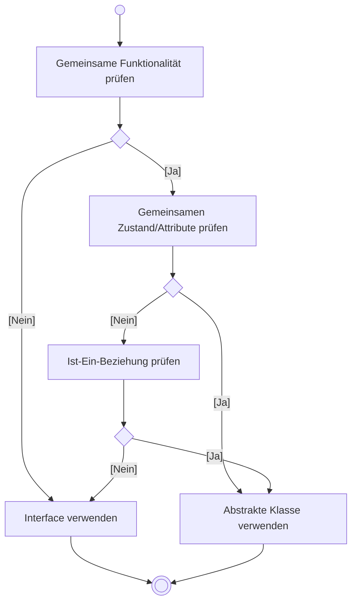

# Abstrakte Klassen

## Das Problem

Manchmal möchten wir eine **Basisklasse** erstellen, die:

1. Gemeinsame Eigenschaften und Methoden für Subklassen definiert
2. Aber **selbst nie instanziiert** werden soll
3. Bestimmte Methoden vorschreibt, die Subklassen **implementieren müssen**

!!! example "Beispiel"
    Eine Klasse `Vehicle` (Fahrzeug) soll gemeinsame Funktionalität für `Car`, `Motorcycle`, `Truck` etc. bereitstellen. Aber es soll kein "generisches Fahrzeug" geben – nur konkrete Fahrzeugtypen.

---

## Die Lösung: Abstrakte Klassen

Eine **abstrakte Klasse** ist eine Klasse, die:

- Mit dem Schlüsselwort `abstract` deklariert wird
- **Nicht instanziiert** werden kann
- **Abstrakte Methoden** enthalten kann (Methoden ohne Implementierung)
- Aber auch **konkrete Methoden** enthalten kann

```java
public abstract class Vehicle {
    // Abstrakte Methode: MUSS von Subklassen implementiert werden
    public abstract void startEngine();
    
    // Konkrete Methode: KANN von Subklassen verwendet werden
    public void printInfo() {
        System.out.println("Dies ist ein Fahrzeug.");
    }
}
```

---

## Syntax

### Abstrakte Klasse deklarieren

```java
public abstract class Klassenname {
    // Attribute
    // Konkrete Methoden
    // Abstrakte Methoden
}
```

### Abstrakte Methode deklarieren

```java
public abstract Rückgabetyp methodenname(Parameter);
```

!!! warning "Wichtig"
    - Abstrakte Methoden haben **keinen Methodenkörper** (keine geschweiften Klammern)
    - Sie enden direkt mit einem **Semikolon**
    - Eine Klasse mit abstrakten Methoden **muss** selbst abstrakt sein

---

## Beispiel: Fahrzeug-Hierarchie

### Die abstrakte Basisklasse

```java
public abstract class Vehicle {
    protected String brand;
    protected String model;
    protected int horsePower;
    
    public Vehicle(String brand, String model, int horsePower) {
        this.brand = brand;
        this.model = model;
        this.horsePower = horsePower;
    }
    
    // Abstrakte Methoden: MÜSSEN implementiert werden
    public abstract void startEngine();
    public abstract void stopEngine();
    public abstract int getMaxPassengers();
    
    // Konkrete Methode: Gemeinsame Funktionalität
    public String getInfo() {
        return brand + " " + model + " (" + horsePower + " PS)";
    }
    
    public void honk() {
        System.out.println("Huuup!");
    }
}
```

### Konkrete Subklassen

```java
public class Car extends Vehicle {
    private int numberOfDoors;
    
    public Car(String brand, String model, int horsePower, int numberOfDoors) {
        super(brand, model, horsePower);
        this.numberOfDoors = numberOfDoors;
    }
    
    @Override
    public void startEngine() {
        System.out.println("Auto startet: Vrrrrm!");
    }
    
    @Override
    public void stopEngine() {
        System.out.println("Auto-Motor ausgeschaltet.");
    }
    
    @Override
    public int getMaxPassengers() {
        return numberOfDoors <= 2 ? 2 : 5;
    }
}
```

```java
public class Motorcycle extends Vehicle {
    private boolean hasSidecar;
    
    public Motorcycle(String brand, String model, int horsePower, boolean hasSidecar) {
        super(brand, model, horsePower);
        this.hasSidecar = hasSidecar;
    }
    
    @Override
    public void startEngine() {
        System.out.println("Motorrad startet: Brumm brumm!");
    }
    
    @Override
    public void stopEngine() {
        System.out.println("Motorrad-Motor ausgeschaltet.");
    }
    
    @Override
    public int getMaxPassengers() {
        return hasSidecar ? 2 : 1;
    }
    
    public void doWheelie() {
        System.out.println("Wheelie!");
    }
}
```

---

## Verwendung

```java
public class VehicleRental {
    private List<Vehicle> vehicles = new ArrayList<>();
    
    public void addVehicle(Vehicle vehicle) {
        // Abstrakte Klasse kann NICHT instanziiert werden:
        // Vehicle v = new Vehicle("BMW", "X1", 150); // FEHLER!
        
        // Nur konkrete Subklassen:
        vehicles.add(vehicle);
    }
    
    public void startAllVehicles() {
        for (Vehicle vehicle : vehicles) {
            System.out.println(vehicle.getInfo());
            vehicle.startEngine(); // Polymorphie!
        }
    }
}

// Verwendung:
VehicleRental rental = new VehicleRental();
rental.addVehicle(new Car("BMW", "3er", 184, 4));
rental.addVehicle(new Motorcycle("Harley", "Sportster", 67, false));
rental.startAllVehicles();
```

---

## Abstrakte Klasse vs. Interface

| Eigenschaft | Abstrakte Klasse | Interface |
|-------------|------------------|-----------|
| Instanziierung | ❌ Nicht möglich | ❌ Nicht möglich |
| Abstrakte Methoden | ✅ Ja | ✅ Ja (alle Methoden) |
| Konkrete Methoden | ✅ Ja | ⚠️ Nur mit `default` (ab Java 8) |
| Attribute | ✅ Ja (auch nicht-statisch) | ❌ Nur `static final` Konstanten |
| Konstruktor | ✅ Ja | ❌ Nein |
| Mehrfachvererbung | ❌ Eine Klasse | ✅ Mehrere Interfaces |
| Sichtbarkeit | Alle Modifier | Immer `public` |

### Wann was verwenden?



!!! tip "Faustregel"
    - **Interface**: Definiert einen **Vertrag** (was eine Klasse können muss)
    - **Abstrakte Klasse**: Definiert eine **Grundstruktur** (was Subklassen gemeinsam haben)

---

## Das Template Method Pattern

Abstrakte Klassen ermöglichen das **Template Method Pattern**:

```java
public abstract class Vehicle {
    
    // Template Method: Definiert den Algorithmus
    public final void performStartSequence() {
        checkFuel();       // Schritt 1: konkret
        startEngine();     // Schritt 2: abstrakt
        warmUp();          // Schritt 3: abstrakt
        System.out.println(brand + " " + model + " ist fahrbereit.");
    }
    
    // Abstrakte "Hooks": Subklassen füllen die Lücken
    protected abstract void startEngine();
    protected abstract void warmUp();
    
    // Konkrete Methode: Gemeinsame Implementierung
    protected void checkFuel() {
        System.out.println("Tankstand wird geprüft...");
    }
}
```

```java
public class Car extends Vehicle {
    
    @Override
    protected void startEngine() {
        System.out.println("Zündung betätigt, Motor startet.");
    }
    
    @Override
    protected void warmUp() {
        System.out.println("Motor wärmt sich auf (30 Sekunden).");
    }
    
    // checkFuel() kann überschrieben werden oder nicht
}
```

!!! success "Vorteil"
    Der **Algorithmus** (die Reihenfolge der Schritte) ist in der Basisklasse fixiert. Subklassen müssen nur die **Details** implementieren.

---

## Zugriffsmodifier `protected`

In abstrakten Klassen wird oft `protected` verwendet:

```java
public abstract class Vehicle {
    protected String brand;       // Sichtbar für Subklassen
    private String serialNumber;  // Nur in dieser Klasse
    
    protected void performSafetyCheck() {  // Für Subklassen nutzbar
        // ...
    }
}
```

| Modifier | Eigene Klasse | Subklasse | Paket | Andere |
|----------|---------------|-----------|-------|--------|
| `private` | ✅ | ❌ | ❌ | ❌ |
| `protected` | ✅ | ✅ | ✅ | ❌ |
| (default) | ✅ | ❌ | ✅ | ❌ |
| `public` | ✅ | ✅ | ✅ | ✅ |

---

## Häufige Fehler

### Fehler 1: Abstrakte Klasse instanziieren

```java
Vehicle v = new Vehicle("BMW", "X1", 150); // FEHLER: Cannot instantiate abstract class
```

### Fehler 2: Abstrakte Methode nicht implementieren

```java
public class Car extends Vehicle {
    // FEHLER: startEngine(), stopEngine(), getMaxPassengers() fehlen!
}
```

### Fehler 3: Abstrakte Methode mit Körper

```java
public abstract void startEngine() {
    // FEHLER: Abstrakte Methoden haben keinen Körper!
}
```

---

## Zusammenfassung

| Konzept | Beschreibung |
|---------|--------------|
| `abstract class` | Kann nicht instanziiert werden |
| `abstract method` | Methode ohne Implementierung |
| Vererbung | Subklassen **müssen** abstrakte Methoden implementieren |
| Konkrete Methoden | Können in abstrakten Klassen vorhanden sein |
| `protected` | Sichtbar für Subklassen |

!!! tip "Merksatz"
    Eine abstrakte Klasse ist ein **Bauplan mit Lücken** – die Subklassen füllen diese Lücken mit konkretem Code.
