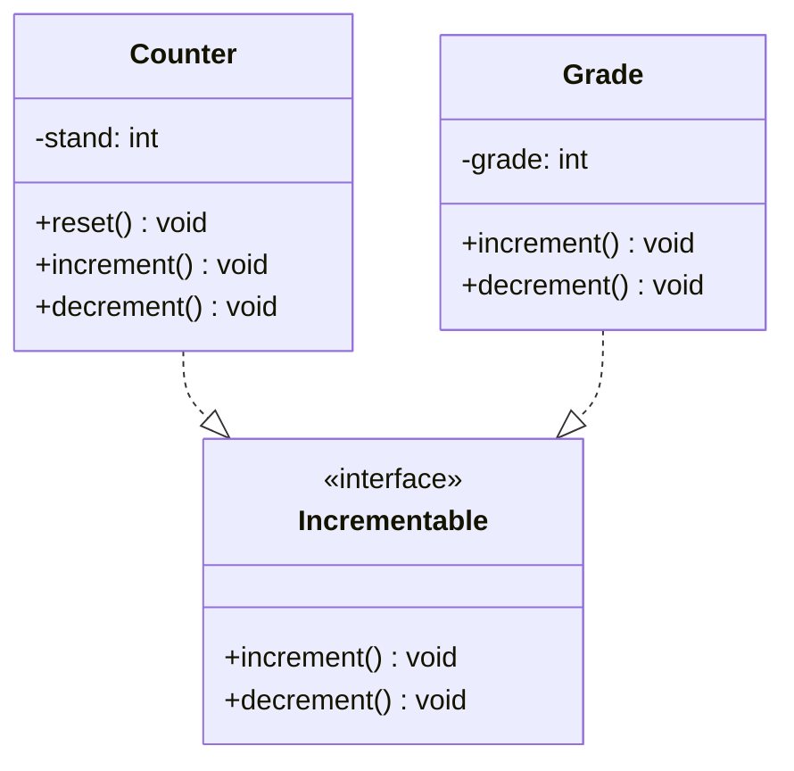

# Interfaces

## Das Problem

Über eine Basisklasse kann gemeinsame Funktionalität an abgeleitete Klassen weitergereicht, also vererbt werden. Voraussetzung dafür ist aber, dass die Objekte der abgeleiteten Klassen auch als Objekte der Basisklasse angesehen werden können, d.h. sie müssen in einer **Ist-Ein-Beziehung** zur Basisklasse stehen.

!!! example "Beispiel"
    Ein Pkw **ist ein** Fahrzeug.

Es gibt allerdings auch Fälle, in denen man in **völlig unterschiedlichen Klassen**, die nichts miteinander zu tun haben, gemeinsame Funktionalität anbieten will.

!!! success "Lösung"
    Für solche Fälle gibt es in Java das Konzept der **Interfaces**.

## Was ist ein Interface?

**Interface** ist das englische Wort für Schnittstelle. Dennoch setzen wir die Worte nicht identisch:

| Begriff | Bedeutung |
|---------|-----------|
| **Schnittstelle** | In Klassen öffentlich deklarierte Methoden |
| **Interface** | Gibt Schnittstellen vor, schreibt also anderen Klassen vor, bestimmte Methoden zu implementieren |

## Definition von Interfaces

```java
public interface Incrementable {    // (1)
    void increment();               // (2)
    void decrement();
}
```

1. Interfaces werden wie Klassen definiert, nur dass statt `class` das Schlüsselwort `interface` verwendet wird
2. Die Methoden sind automatisch **abstrakt** und **öffentlich**

!!! tip "Namenskonvention"
    Namen von Interfaces enden häufig mit **-able** (Accessible, Comparable, Runnable). Er beginnt üblicherweise **nicht** mit einem Präfix wie »I«.

!!! note "Hinweis"
    Die Modifizierer `abstract` und `public` sollten bei Interface-Methoden nicht geschrieben werden, obwohl der Compiler sie akzeptiert.

Interfaces können auch `public static final`-Konstanten enthalten. Da sie keine Attribute und ausimplementierte Methoden besitzen, können sie **nicht instanziiert** werden.

## Sinn von Interfaces

Der Sinn eines Interfaces besteht darin, von anderen Klassen **implementiert** zu werden. Dann wirkt das Interface wie ein **Vertrag**: Die Klassen, die es implementieren, verpflichten sich damit, die im Interface enthaltenen Methoden auszuimplementieren.

### Beispiel: Counter implementiert Incrementable

```java
public class Counter implements Incrementable {
    private int stand;
    
    public Counter(int start) {
        stand = start;
    }
    
    public void reset() {
        stand = 0;
    }
    
    public void increment() {
        stand++;
    }
    
    public void decrement() {
        stand--;
    }
}
```

### Beispiel: Grade implementiert Incrementable

```java
public class Grade implements Incrementable {
    private int grade;
    
    public Grade(int grade) {
        this.grade = grade;
    }
    
    public void increment() {
        if (grade < 15) {
            grade++;
        }
    }
    
    public void decrement() {
        if (grade > 0) {
            grade--;
        }
    }
}
```

!!! success "Gemeinsame Schnittstelle"
    Beide Klassen verfügen durch Implementierung des Interfaces über eine **gemeinsame öffentliche Schnittstelle**. Durch Vererbung wäre das nicht zu erreichen gewesen, denn es ließe sich nur mit viel Mühe eine gemeinsame Basisklasse finden!

## Syntax

Soll eine Klasse ein Interface implementieren, folgt hinter dem Klassennamen das Schlüsselwort `implements` und dann der Name des Interfaces:

```java
public class Klasse extends Basisklasse implements InterfaceA, InterfaceB
```

!!! info "Mehrfachvererbung"
    **Mehrfachvererbung** (eine abgeleitete Klasse besitzt zwei oder mehrere Basisklassen) ist in Java nicht erlaubt. Klassen können nur **eine** Basisklasse besitzen. Interfaces erlauben ein Ersatzkonstrukt, indem von einer Klasse geerbt und **ein oder mehrere Interfaces** implementiert werden.

## UML-Notation

Im Klassendiagramm wird ein Interface durch ein Klassensymbol mit dem Stereotypen `<<interface>>` modelliert. Die Implementierung eines Interfaces wird mit einem **gestrichelten Vererbungspfeil** symbolisiert.



## Nutzen der gemeinsamen öffentlichen Schnittstelle

Da alle Klassen, die ein bestimmtes Interface implementieren, den **Typ des Interfaces** haben, können sie:

- **gemeinsam verwaltet** werden
- **Polymorphie** auf ihnen angewandt werden

### Beispiel: Polymorpher Container

```java
public class Main {
    public static void main(String[] args) {
        ArrayList<Incrementable> container = new ArrayList<Incrementable>();
        container.add(new Counter(1));
        container.add(new Counter(234));
        container.add(new Grade(12));
        container.add(new Grade(15));
        
        for (Incrementable obj : container) {
            obj.increment();
        }
    }
}
```

!!! tip "OO-Entwurfsprinzip"
    **Programmiere auf eine Schnittstelle, nicht auf eine Implementierung!**
    
    Die Klasse `Main` muss nichts von der konkreten Implementierung der Klassen `Counter` und `Grade` wissen. Sie stützt sich allein auf das Interface `Incrementable`. Damit ist sie von Änderungen der konkreten Klassen nicht betroffen – diese könnten sogar durch andere Klassen ersetzt werden!
