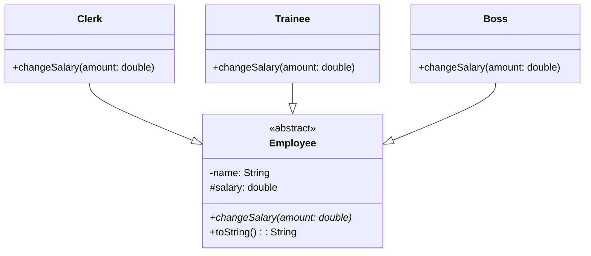

# Polymorphie

## Die drei Grundprinzipien der OOP

Die objektorientierte Programmierung beruht auf drei Grundprinzipien:

1. **Kapselung** ✓
2. **Vererbung** ✓
3. **Polymorphie** (Polymorphismus)

## Was ist Polymorphie?

Polymorphie beruht darauf, dass unterschiedliche Objekte (z.B. Löwe, Zebra, Delphin, Seeadler etc.) auf ihre **Gemeinsamkeiten reduziert** und nur als Repräsentanten dieser Gemeinsamkeiten betrachtet werden.

### Beispiel: Tiere im Zoo

In der OOP würden die Tiere aus dem Beispiel als je eigene Klasse umgesetzt:

- Ein Löwe wäre ein Objekt der Klasse `Lion`
- Ein Zebra ein Objekt der Klasse `Zebra`
- usw.

Die **Gemeinsamkeiten** aller Tiere würden in eine Superklasse `Animal` ausgelagert, die diese Gemeinsamkeiten an alle konkreten Tierklassen vererbt.

Eine Gemeinsamkeit aller Tiere wäre z.B., dass alle Tiere **fressen**. Die Klasse `Animal` hätte also eine Methode `eat()`.

!!! question "Problem"
    Nun frisst natürlich nicht jedes Tier auf die gleiche Art und Weise. Ein Zebra, das gemütlich auf der Weide grast, frisst anders als ein Löwe, der eben solche Zebras jagt und frisst.

### Lösung: Methoden überschreiben

Wenn wir also ein Tierobjekt vom Typ der Klasse `Zebra` speichern, wollen wir, dass es **wie ein Zebra** frisst. Deswegen wird die Methode `eat()`, die die Klasse `Zebra` von der Klasse `Animal` erbt, **überschrieben**.

!!! success "Definition"
    Unter **Polymorphie** versteht man das unterschiedliche Verhalten verschiedener Objekte beim Aufruf **derselben Methode**.

## Späte Bindung

Objekte von unterschiedlichen Klassen, die aber eine gemeinsame Basisklasse haben, können in Variablen vom **Typ der Basisklasse** referenziert werden.

An allen Stellen im Programm (Variablen, Arrays, Collections), an denen der Basistyp verlangt ist, kann also auch ein **Objekt einer Subklasse** stehen.

Bei einem Methodenaufruf wird dann anhand des Klassentyps des tatsächlich gespeicherten Objekts **zur Laufzeit** entschieden, welche Ausprägung einer Methode tatsächlich ausgeführt wird.

!!! info "Späte Bindung"
    Diesen Vorgang bezeichnet man auch als **späte Bindung** (late binding).

## Ausführliches Beispiel: Mitarbeitergehälter

Es soll ein Programm zur Verwaltung von Mitarbeitergehältern geschrieben werden.

### Gemeinsame Eigenschaften (abstrakte Superklasse)

```java
public abstract class Employee {
    private String name;
    protected double salary;

    public Employee(String name, double salary) {
        this.name = name;
        this.salary = salary;
    }

    public abstract void changeSalary(double amount);

    public String toString() {
        return "Name: " + name + "\nGehalt:" + salary;
    }
}
```

### Unterschiedliche Regeln für verschiedene Mitarbeitertypen

| Mitarbeitertyp | Regel für Gehaltsänderungen |
|----------------|----------------------------|
| **Angestellte** | Gehalt darf beliebig angepasst werden |
| **Praktikanten** | Dürfen nicht mehr als 430 € verdienen |
| **Chefs** | Verdienen mindestens 4.000 €, Gehalt darf nicht gekürzt werden |

### Konkrete Klassen

```java
public class Clerk extends Employee {
    public Clerk(String name, double salary) {
        super(name, salary);
    }

    @Override
    public void changeSalary(double amount) {
        if (salary + amount > 0) {
            salary = salary + amount;
        }
    }
}
```

```java
public class Trainee extends Employee {
    public Trainee(String name, double salary) {
        super(name, salary);
    }

    @Override
    public void changeSalary(double amount) {
        if (salary + amount <= 430) {
            salary = salary + amount;
        }
    }
}
```

```java
public class Boss extends Employee {
    public Boss(String name, double salary) {
        super(name, salary);
    }

    @Override
    public void changeSalary(double amount) {
        if (amount > 0 && salary + amount >= 4000) {
            salary = salary + amount;
        }
    }
}
```

### Polymorphie in Aktion

```java
public class EmployeeUI {
    public static void main(String[] args) {
        ArrayList<Employee> employees = new ArrayList<Employee>();
        employees.add(new Trainee("Bertram", 400));
        employees.add(new Clerk("Mueller", 2400));
        employees.add(new Boss("Boerne", 4000));

        for (Employee a : employees) {
            a.changeSalary(300);
            System.out.println(a.toString());
        }
    }
}
```

### Ausgabe

```
Name: Bertram
Gehalt:400.0
Name: Mueller
Gehalt:2700.0
Name: Boerne
Gehalt:4300.0
```

!!! success "Ergebnis"
    - Beim Praktikanten Bertram wurde die Gehaltserhöhung **nicht** durchgeführt (würde 430 € überschreiten)
    - Bei den anderen Mitarbeitern wurde die Gehaltsänderung durchgeführt
    - Je nach **Typ des gespeicherten Mitarbeiters** wurde eine andere Ausprägung der Methode `changeSalary()` aufgerufen

## Polymorpher Container

Die Liste fungiert hier als **polymorpher Container**, d.h. er kann Objekte aller Subklassen von `Employee` speichern.


