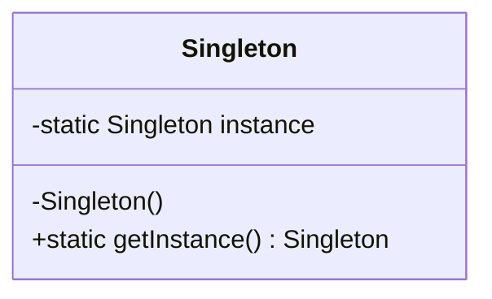

# Das Singleton-Muster

## Was sind Entwurfsmuster?

In der Softwaretechnik gibt es Entwurfsprobleme, die in sehr vielen Anwendungen auftauchen. Für solche immer wiederkehrenden Probleme gibt es Lösungswege, die sich allgemein in der Praxis bewährt haben.

Solche Lösungsschablonen werden **Entwurfsmuster** (englisch: *design patterns*) genannt.

!!! info "Eigenschaften von Entwurfsmustern"
    - Sie beschreiben die wichtigen Entwurfsentscheidungen
    - Sie stellen eine wiederverwendbare Vorlage zur Problemlösung zur Verfügung
    - Sie sind in einem bestimmten Problemzusammenhang einsetzbar

### Vorteile von Design Patterns

Durch den Einsatz von Design Patterns wird ein Entwurf:

- **flexibel**
- **wiederverwendbar**
- **erweiterbar**
- **einfacher zu verwenden**
- **änderungsstabil**

!!! tip "Wissen nutzen"
    In den Entwurfsmustern manifestiert sich die jahrelange Berufserfahrung vieler Softwareentwickler. Deren Wissen und Erfahrung wird nutzbar gemacht, ohne vorher den teuren Prozess der Entwurfsentwicklung erneut durchlaufen zu müssen.

## Das Problem

Ein immer wieder auftauchendes Problem ist, dass eine Klasse nur **ein einziges Mal** instanziiert werden darf.

Für diese Problemstellung gibt es das **Singleton-Muster**.

!!! success "Singleton-Muster"
    Das Singleton-Muster sorgt dafür, dass es von einer Klasse, im Folgenden **Singleton** genannt, nur **eine Instanz** gibt und diese **global** zur Verfügung steht.

## Implementierung

```java
public class Singleton {
    private static Singleton instance = null;

    private Singleton() {
    }

    public static Singleton getInstance() {
        if (instance == null) {
            instance = new Singleton();
        }
        return instance;
    }
}
```

## Erklärung

Der Kniff der einmaligen Erzeugung besteht nun darin, in die **Klassenmethode** eine Abfrage einzubauen, die das Klassenattribut daraufhin befragt, ob es den Voreinstellungswert `null` enthält.

### Ablauf

1. **Erste Anfrage:** Wenn `instance == null`, dann ist das Objekt noch nicht erzeugt. In diesem Fall wird von der Klassenmethode aus der **private Konstruktor** aufgerufen und ein Objekt des Singletons erzeugt. Die Objektreferenz wird in dem Klassenattribut gespeichert.

2. **Weitere Anfragen:** Steht bereits eine Objektreferenz in dem Klassenattribut, dann wird **kein weiteres Objekt** erzeugt, sondern nur die Referenz zurückgegeben.

### Wichtige Elemente

| Element | Zweck |
|---------|-------|
| `private static Singleton instance` | Speichert die einzige Instanz als Klassenattribut |
| `private Singleton()` | Verhindert externe Instanziierung |
| `public static Singleton getInstance()` | Einziger Zugriffspunkt auf die Instanz |



## Anwendungsbeispiele

- **Konfigurationsmanager**: Es soll nur eine zentrale Konfiguration geben
- **Logger**: Nur ein Logger für die gesamte Anwendung
- **Datenbankverbindung**: Nur eine Verbindung zur Datenbank
- **Spielzustände**: Nur eine Instanz eines bestimmten Zustands (wie in unserem Zuul-Spiel)
